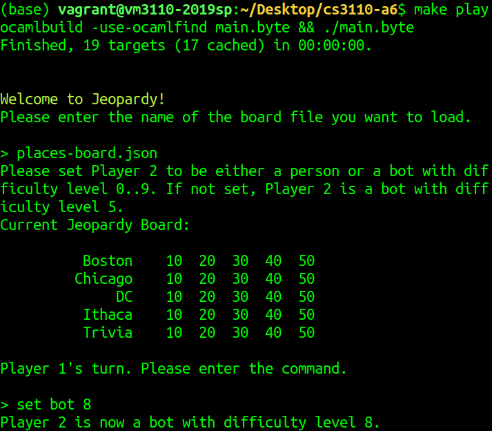

# ocaml-jeopardy
Interactive OCaml Jeopardy game. Open-ended group midterm project for CS 3110. 

Type command `make play` in the main directory to play the game. 
User may use command `set person` to choose a two-player user-vs-user game or `set bot [difficulty level]` to choose a one-player user-vs-bot game.  
Bot answers correctly or incorrectly at random, with probability of correctness determined by user-specified bot difficulty level. 
Bot chooses point values strategically based on overall game progress and the score. 
User must answer (`answer` command) within 10-second time limit or answer is considered incorrect. 
User also has option to `pass` on a question rather than risk guessing incorrectly. 
`wager` command is used for Daily Doubles and Final Jeopardy. 
`score` command shows the current score. 
Any json board may be used in place of the default ones, given that it fits the schema. 

Use command `make play` in directory `cs3110-a6-master` to play the game. The first two questions of a sample player-vs-bot game are shown below. 

